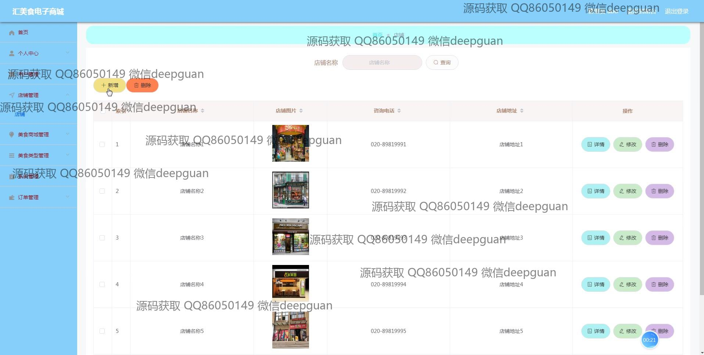
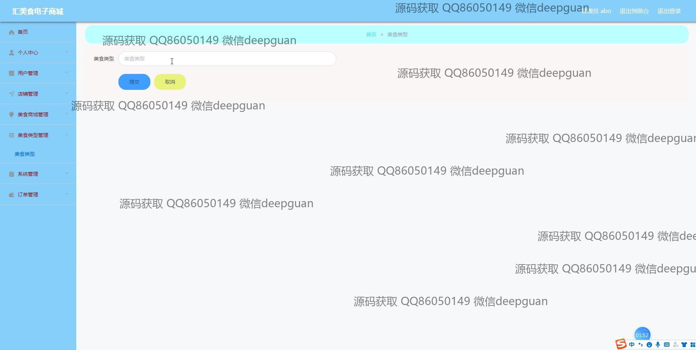

<h1 align="center">基于Vue框架的汇美食电子商城的设计与实现</h1>

## 简介
汇美食电子商城：角色分为管理员、用户；主要功能包括用户管理、店铺管理、美食管理、订单管理、地址管理和个人信息编辑。界面简洁直观，便于操作和用户交互。    --计算机毕业设计源码；毕设源码；java毕业设计源码

## 联系方式

<h3 align="center">获取完整代码与数据库文件 + 微信：deepguan QQ: 86050149 QQ群: 783742310</h3>

<h3 align="center">可帮忙远程部署 包运行成功！提供远程部署、修改代码、设计文档指导、代码讲解等服务！</h3>

## 功能介绍（完整见运行截图）
管理员：  
基本功能包括登录、注册、注销，系统提供个人中心管理功能，如修改个人信息、查看或更改密码等；支持后台管理店铺信息，包括添加店铺名称、上传图片、设置咨询电话、编辑店铺简介；提供商品管理功能，可对美食详情进行编辑，包括图片上传、价格设置、详细描述；支持订单管理，查看订单详情、修改状态、发货及删除；可通过美食类型管理模块分类新增或编辑商品类型。  

用户：  
基本功能包含登录、注册、退出，个人中心支持查看及修改个人信息、管理收货地址、查询订单和收藏记录；在商城主页，用户可浏览轮播图、商品推荐、店铺信息和政策资讯；支持商品列表搜索与筛选，查看详情并添加至购物车进行结算；提供订单支付与状态查询功能，增强购物体验。  

访客：  
可在商城首页浏览商品列表、扶贫政策及店铺展示；支持商品详情查看和评论区互动；可以通过导航栏访问店铺、美食商城或网站资讯，获取更多信息。

## 运行截图

本代码来源于网络,仅供学习参考使用!

